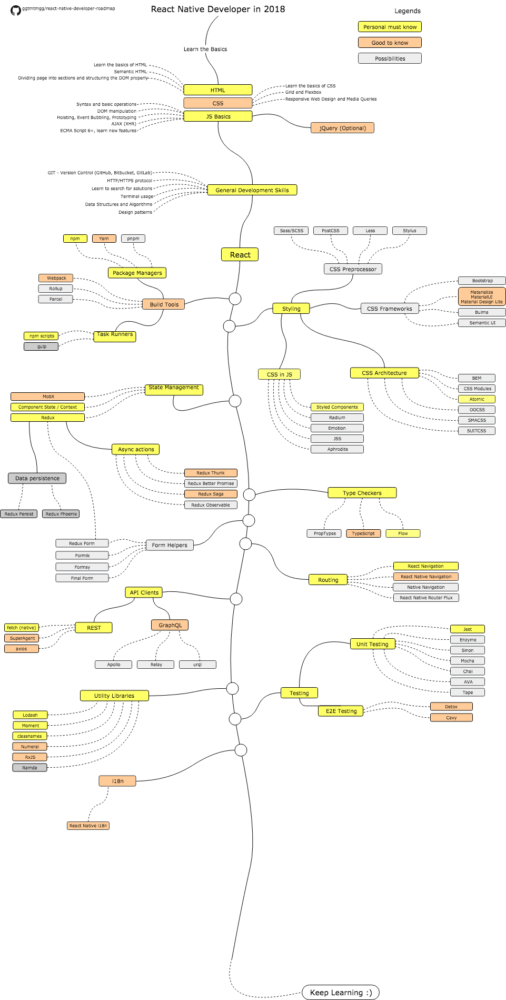

NOTE: This repository is under construction.

# React Native Developer Roadmap

> Roadmap to becoming a React Native developer in 2018 highly inspired by [React Developer Roadmap](https://github.com/aasstar/react-developer-roadmap).

## Roadmap

## Contribution

The roadmap is built using [Draw.io](https://www.draw.io/). Project file can be found at `/src` directory. To modify it, open draw.io, click **Open Existing Diagram** and choose `xml` file with project. It will open the roadmap for you, update it, upload and update the images in readme and create a PR (export as png).

- Open pull request with improvements
- Discuss ideas in issues
- Spread the word

## License

